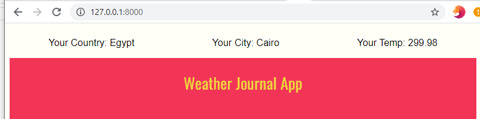
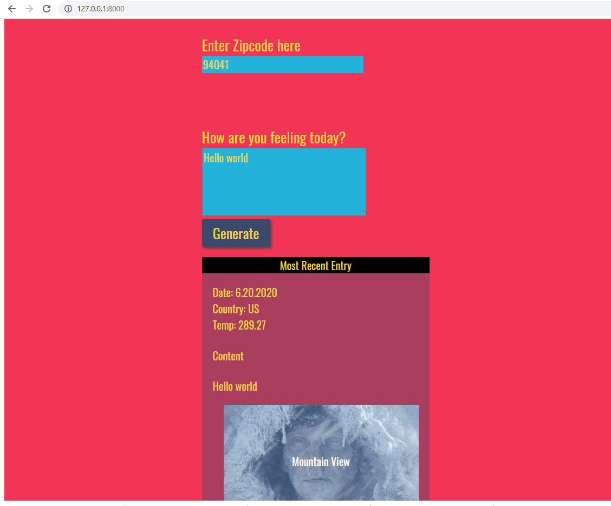

# weather_journal_app

## API's:
* https://geolocation-db.com/
* https://home.openweathermap.org/api_keys

## packges:
* express
* cors
* body-parser

## how to use:
* port: 8000
* download the project
* add folder into usesrs > youruser
* open command line
* cd wether
* npm init
* node server.js
* It will automatic detect your IP then use gealocation API to get your geolocation and data city and country
* then it pass the parameters to the second function and show your current city and country and temp without you do any thing(Advanced)
* last you can enter city zip code and your comment and it will show the temp 

* it will show all comments during the session i was working on return from database but some duplicate due to foreach need jinja2 or something

## note
for some reason the temp not apear good, even in one call API 
